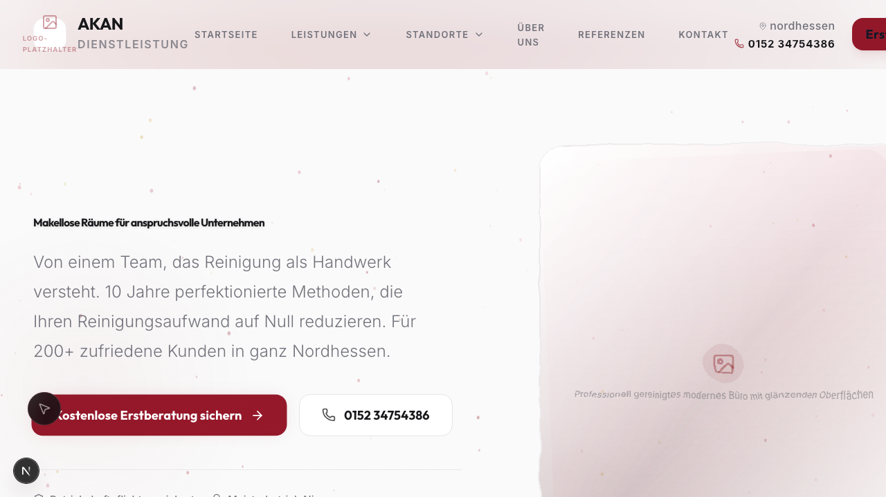
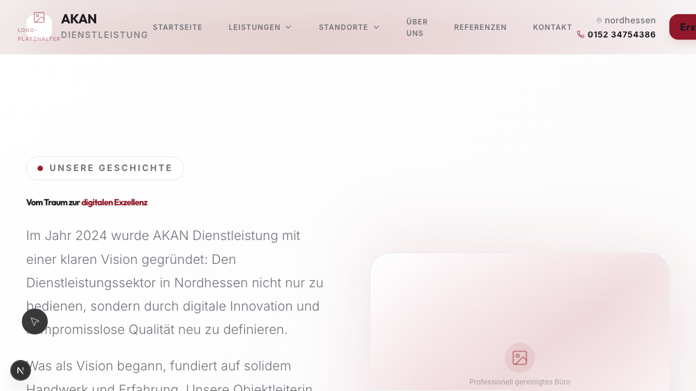

<div align="center">
  
  <br />
  <br />

  <p>
    <b>Premium Gebäudereinigung & Facility Management Plattform</b>
  </p>

  <p>
    
    
    
    
  </p>

  <p>
    
    
    
  </p>
</div>

---

## 🌟 Über das Projekt

Dies ist die offizielle, proprietäre Unternehmenswebsite und digitale Vertriebsplattform für **AKAN Dienstleistung**. Entwickelt mit einem kompromisslosen Fokus auf Performance, SEO, Barrierefreiheit (WCAG) und eine strikte "Zero-Cookie"-Datenschutzrichtlinie.

🌐 **Live Ansicht:** [akan-dienstleistung.de](https://akan-dienstleistung.de)

## ✨ Kern-Features

- ⚡ **Next.js 15 App Router:** Vollständige SSR/SSG Architektur für maximale SEO-Performance und minimale Ladezeiten (0.1s Time-to-Interactive).
- 🧩 **Zero-Tolerance Privacy:** Eigenentwickeltes striktes Consent-Management. **Keine** Drittanbieter-Cookies ohne explizite User-Zustimmung.
- 📱 **Mobile-First Glassmorphism UI:** Hochwertiges Design mit Tailwind CSS v4, Framer Motion Animationen und Fluid Typography.
- 🗺️ **Interaktive Standortkarte:** Serverseitig gerenderte Map-Fallback-Boundary mit dynamischem Leaflet Client-Render.
- 🛡️ **Zod + React Hook Form:** Typensichere, barrierefreie Kontaktformulare mit Serverseitiger validierung.

---

## 📸 Impressionen

<p align="center">
  
  
</p>

---

## 🚀 Lokales Setup (Getting Started)

Das Projekt nutzt den modernen Node-Stack. Ein lokaler Fork ist nur für autorisierte Entwickler vorgesehen.

### Voraussetzungen

- **Node.js**: `v20.0.0` oder höher (wird über `engines` erzwungen)
- **NPM**: `v10+`

### Installation

1. **Repository klonen**

   ```bash
   git clone https://github.com/umutcantezgel-cpu/Akan-Dienstleistung.git
   cd Akan-Dienstleistung
   ```

2. **Abhängigkeiten installieren**
   _(Nutze `ci` für exakt reproduzierbare Builds via `package-lock.json`)_

   ```bash
   npm ci
   ```

3. **Environment konfigurieren**
   Kopiere die `.env.example`:

   ```bash
   cp .env.example .env.local
   ```

   _(Füge hier z.B. den `RESEND_API_KEY` für das Kontaktformular ein)_

4. **Entwicklungsserver starten**
   ```bash
   npm run dev
   ```
   Die App ist nun unter `http://localhost:3000` erreichbar.

---

## 🛠️ Developer Guides & Architektur

Für tiefergehende technische Details zum Codebase-Aufbau, lies bitte unsere Meta-Dokumente:

- 🏗️ **[Architektur-Manifest (docs/ARCHITECTURE.md)](docs/ARCHITECTURE.md)**: Details zu SSR-Strategien, Component-Hierarchy und State-Management.
- 🆘 **[Troubleshooting (docs/TROUBLESHOOTING.md)](docs/TROUBLESHOOTING.md)**: Lösung bekannter Hydration-Fehler oder Map-Rendering-Probleme.
- 🤝 **[Contributing Guidelines (CONTRIBUTING.md)](CONTRIBUTING.md)**: Regeln für Branches, Commits und PRs.

---

## ☁️ Deployment

Das Projekt ist vollständig CI/CD-kompatibel und production-hardened für Vercel und Netlify.

- **Vercel:** Auto-Deploys aktiv für den `main` Branch. Zero Configuration required.
- **Netlify:** Nutzt die dedizierte `netlify.toml` für SSR/ISR via `@netlify/plugin-nextjs`.

**Production Build lokal testen:**

```bash
npm run build && npm run start
```

---

## 📄 Lizenz & Copyright

**Copyright © 2024 AKAN Dienstleistung. Alle Rechte vorbehalten.**

Der Quellcode in diesem Repository ist proprietär und vertraulich. Vervielfältigung, Modifikation oder Distribution jeglicher Art sind ohne ausdrückliche schriftliche Genehmigung von AKAN Dienstleistung strengstens untersagt. Siehe [LICENSE](LICENSE) für Details.
